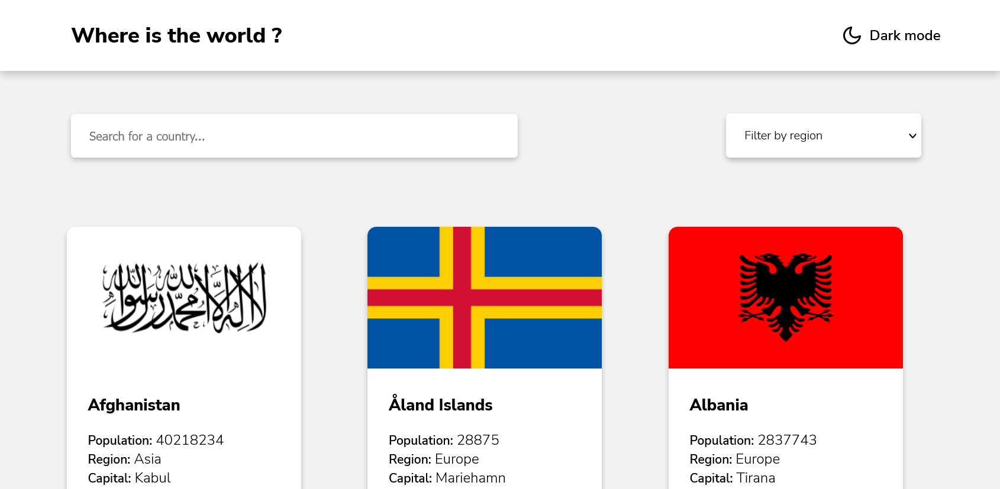

# Frontend Mentor - REST Countries API with color theme switcher solution

## The challenge

Users should be able to:

- See all countries from the API on the homepage
- Search for a country using an `input` field
- Filter countries by region
- Click on a country to see more detailed information on a separate page
- Click through to the border countries on the detail page
- Toggle the color scheme between light and dark mode *(optional)*

## Links

- Live Site URL: 
- Api: 
